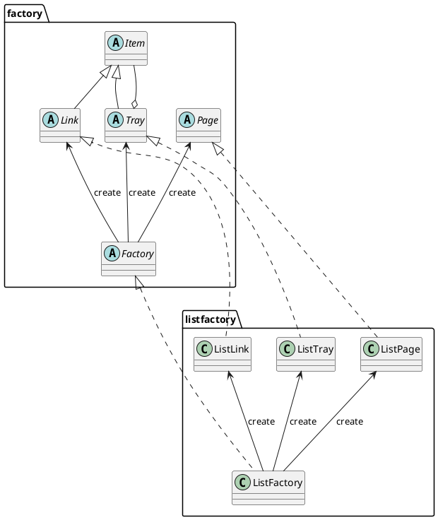

## クラス一覧

| package     | name        | description                            |
|-------------|-------------|----------------------------------------|
| factory     | Factory     | Abstract Factory                       |
| factory     | Item        | Abstraction of `Link` and `Tray`       |
| factory     | Link        | Abstract URL Link                      |
| factory     | Tray        | Aggregate of `Link` or `Tray`          |
| factory     | Page        | Abstract HTML Page                     |
|             |             |                                        |
| (none)      | Main        | Main class                             |
| listfactory | ListFactory | Concrete Factory                       |
| listfactory | ListLink    | Concrete URL Link                      |
| listfactory | ListTray    | Concrete aggregate of `Link` and `Tag` |
| listfactory | ListPage    | Concrete HTML Page                     |

## クラス図

## 所感

- Abstract のFactoryクラスはいらんな。
    - どのFactoryを使用するかについてはDIコンテナなどに任せることになるだろう
    - この例でいくと、Trayインターフェースを実装するクラスはひとつではなく、ULを使ったリストも、OLを使ったリストも両方が欲しくなるだろう。
    - DSL的にオブジェクトの構築を行うために、具象クラスがわの各クラスを生成するFactoryはあってよいだろう
- 抽象側はより検討が必要だろう。
    - この例でいくと、ItemではなくDomElementのようなインターフェース名がふさわしいし、TrayはまだしもLinkは具体的すぎる
    - ネストできたい単体のDOMエレメントとするのがよいだろう
