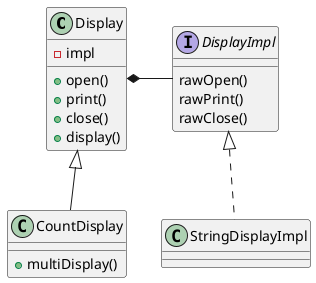

# Bridge Pattern

## class list

| type       | naem              | description                             |
|------------|-------------------|-----------------------------------------|
| extends    | Display           | class for display something             |
| extends    | CountDisplay      | class for display multiple times        |
|            |                   |
| implemets  | DisplayImpl       | trait for display something             |
| implements | StringDisplayImpl | concrete display something using string |

## class diagram

## 所感

- あいかわらず、例がわるい。
    - DisplayImplに相当するインターフェースとして、I/Oを表現する Readable や Writable を考えるとわかりやすい
    - Display に相当するクラスが、メンバーフィールドとして DisplayImpl を保持しているが、メソッドの引数に渡すようにした方が柔軟性が高い
    - Javaでは難しいが、単純に引数に渡すのではなく、クラスのジェネリックパラメータとして渡すなども考えられる
- DisplayとCountDisplayといった実装側の階層関係は例のためのそれで、Bridgeとは関係ないと見た。
    - サブタイプ CountDisplay の実装に必要な機能を DisplayImpl に委譲することはできない
- CountDisplay の multiDisplay の実装で、親クラスの open(), Close() が使われている
    - 実装の詳細部を DisplayImpl に委譲しているのだから、CountDisplay の multiDisplay も一貫して DisplayImpl を使用するべきでは？
