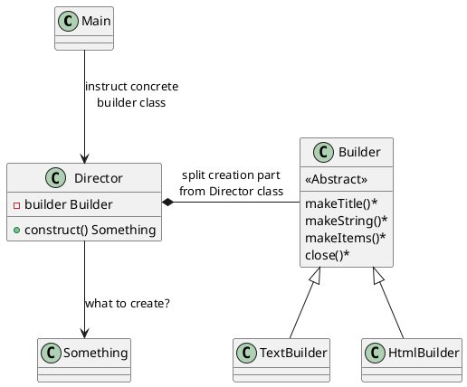
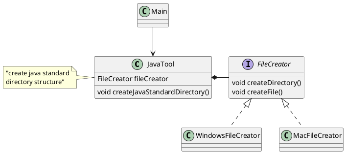
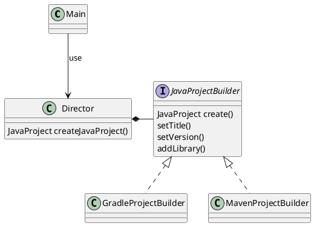

# Builderパターン

- Directorで通常は行う「構築」を一部Builderに切り出している
- TextBuilder, HtmlBuilder と複数のサブタイプが作られているのは例。おまけ
- Builderパターンなので、「何か」を作っているが、サンプルは Director#construct の戻り地が void なので、何を作ろうとしているのかがわからない。
    - BuilderクラスのサブタイプTextBuilder、HtmlBuilderが作る「何か」は別ものなので、まとめるのは難しい
    - サンプルでは、ファイルに出力することで作る「何か」を無理やり同じにしているのかな
- Directorクラスが単純であれば、Builderに分ける必要はないだろう。直接Template Methodパターンにする
- Builderの実装が複数存在しない場合、抽象メソッドと具象メソッドに分割する必要はないだろう

## 他に良い例はないか？

例えば、Javaの標準的なディレクトリ構造を作成するツールを作成することを考える

- Directorクラスでは、src/main/java といったフォルダを決まったルールに従い作成する
- Builderは、ディレクトリを作成する、ファイルを作成するといった抽象メソッドが定義されている
- OSごとに、実際にディレクトリを作成する実装が異なるので、これをサブクラスに分けてWindows用、MacOS用、と作る
    - 第３のOSが増えても、サブタイプを作ることで対応できる

## あるいは

ディレクトリ構造ではなく、「Javaプロジェクトそのもの」を考えるのはどうだろう

Javaのプロジェクトで代表的なものは「Gradleプロジェクト」「Mavenプロジェクト」

