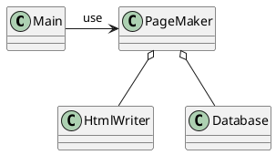

# クラス一覧

| package   | name       | description                            |
|-----------|------------|----------------------------------------|
| pagemaker | Database   | get e-mail addresses from database     |
| pagemaker | HtmlWriter | create HTML file                       |
| pagemaker | PageMaker  | create THML file from e-mail addresses |

# クラス図

