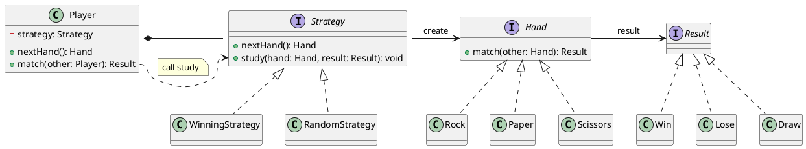

# Strategy Pattern

## class list

| name            | description                  |
|-----------------|------------------------------|
| Hand            | Rock-Paper-Scissors Hand     |
| Strategy        | Rock-Paper-Scissors Strategy |
| WinningStrategy | Play same Hand if win        |
| RandomStrategy  | Play random Hand             |
| Player          | Rock-Paper-Scissors player   |
| Main            |                              |

## class diagram

## 所感
