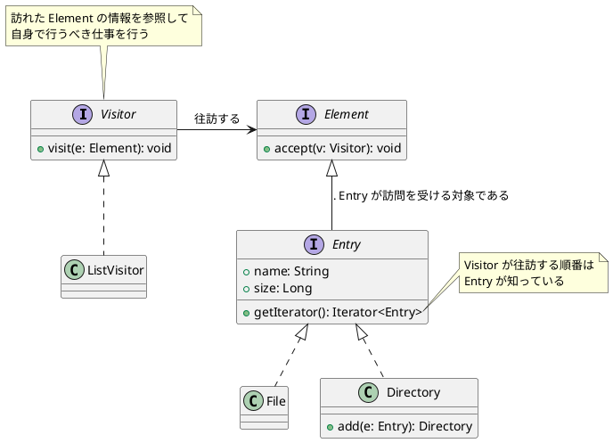

# クラスとインターフェース一覧

| name        | description                                            |
|-------------|--------------------------------------------------------|
| Visitor     | the interface of visitor which visit file or directory |
| Element     | the interface of acceptor which accept a visitor       |
| ListVisitor | concrete visitor which list file and directories       |
| Entry       | the interface to identify files and directories        |
| File        | file class                                             |
| Directory   | directory class                                        |

# サンプルプログラムのクラス図

